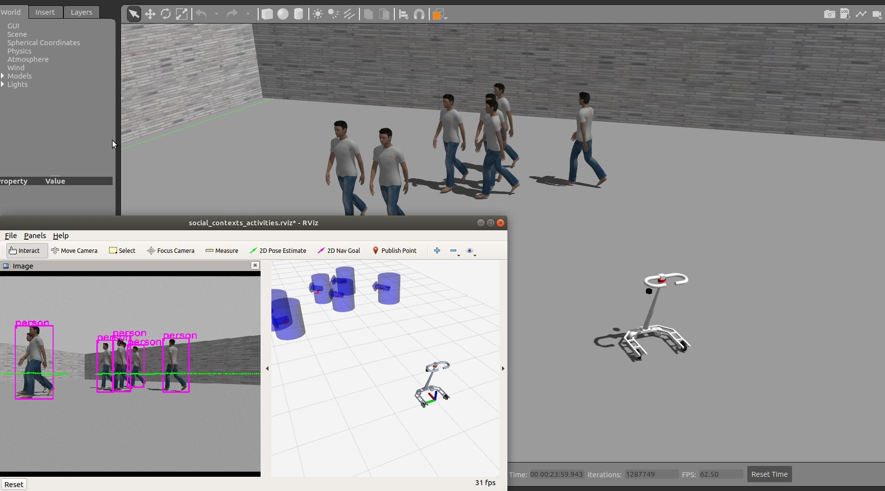

# active-walker
The repo is prepared for the active walker project for elders or people in mobility impaired. The code will be completely released after finishing development and robustness testing.

## Simulation
The walking assist robot is conducting the pedestrians tracking with camera and laser scanner in Gazebo environment.

